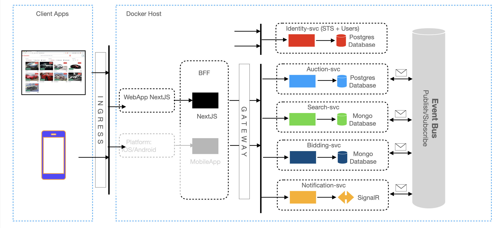
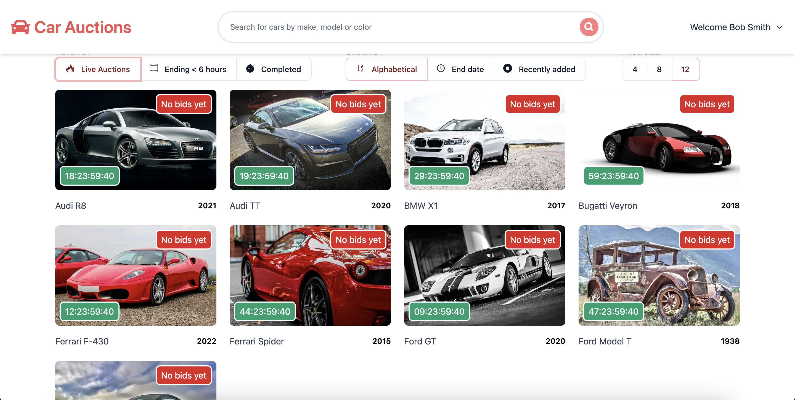
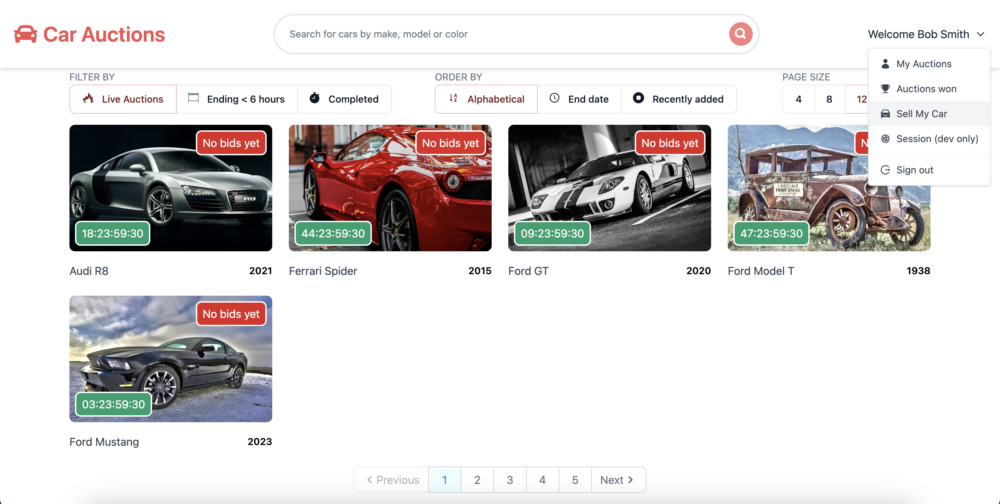
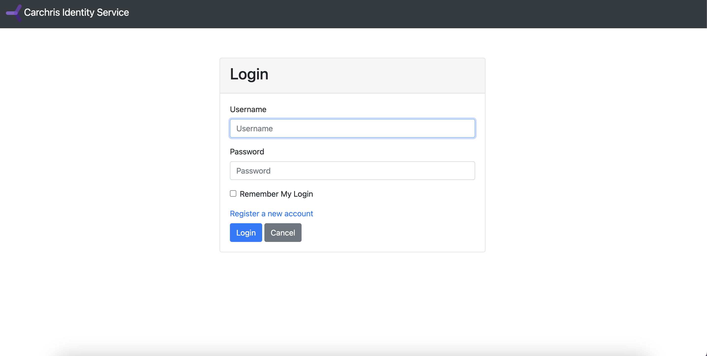
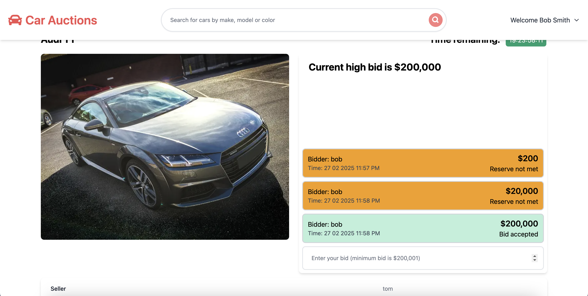

# Carchris Project

## Overview
Welcome to the Carchris project! This project is built as .NET 8, Next.js 15, and Next-Auth. 

## Features
- **Backend Services**: Several microservices built using .NET to provide different functionalities.

- **Resilience & Fault Tolerance**: Using Polly to implement retries, circuit breakers, and fallback policies.

- **Service Communication**: Implementing communication between services using RabbitMQ and gRPC.

- **Identity Management**: Using IdentityServer as the identity provider.

- **API Gateway**: Creating a gateway with Microsoft YARP.

- **Frontend Application**: A client-side app built with Next.js, leveraging the new App Router functionality.

- **Real-time Notifications**: Implementing SignalR for push notifications.

- **Containerization**: Dockerizing the microservices for deployment.

- **CI/CD Workflows**: Using GitHub Actions to automate builds and deployments.

- **Ingress Controllers**: Adding and configuring ingress controllers.

- **Local Deployment**: Running and publishing the entire application locally using Docker Compose.

- **Kubernetes Deployment**: Supporting scalable deployment to a Kubernetes cluster.

## Technologies

- **Technologies**: .NET 8 | Next.js 15 | Next-Auth | Docker | RabbitMQ | Microsoft YARP | SignalR | IdentityServer
- **Databases**: PostgreSQL | MongoDB

GitHub Actions (for CI/CD workflows)

## Screenshot
<div style="display: flex; justify-content: center; gap: 20px;">
  
  
</div>
<div style="text-align: center; margin-top: 20px;">
  
  
  
</div>

<!-- 
## Installation
To install the project, follow these steps:

1. Clone the repository:
  ```bash
  git clone https://github.com/yourusername/Carchris.git
  ```
2. Navigate to the project directory:
  ```bash
  cd Carchris
  ```
3. Install the dependencies:
  ```bash
  npm install
  ``` -->

## Usage
To start the project using Kubernetes run:
```bash
kubectl apply -f k8s/
```
Then open your browser and go to `app.carchris.local`.
<!-- 
## Contributing
We welcome contributions! Please read our [contributing guidelines](CONTRIBUTING.md) for more details.

## License
This project is licensed under the MIT License. See the [LICENSE](LICENSE) file for more information.

## Contact
If you have any questions or feedback, please feel free to reach out to us at [your email address].

Thank you for using Carchris! -->
